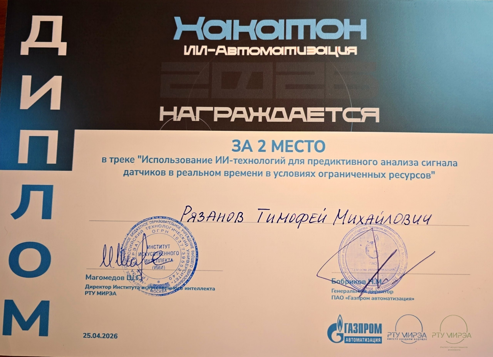

# Сертификаты и дипломы с хакатонов

В этом репозитории собраны подтверждающие документы об участии и призовых местах в инженерных и IT-хакатонах.

### 🥈 2 место — Хакатон «Газпром-Автоматизация» (Апрель 2026)
Разработка модуля диагностики сигналов для прогнозирования раннего отказа датчиков.

### 🏅 Участник — «AI-хакатон» от «Сибинтек-Софт» (Ноябрь 2025)
Разработка модуля детекции активности на видеофрагменте.
[Посмотреть сертификат Сибинтек в формате PDF](./sertificat_sibintek.pdf)
